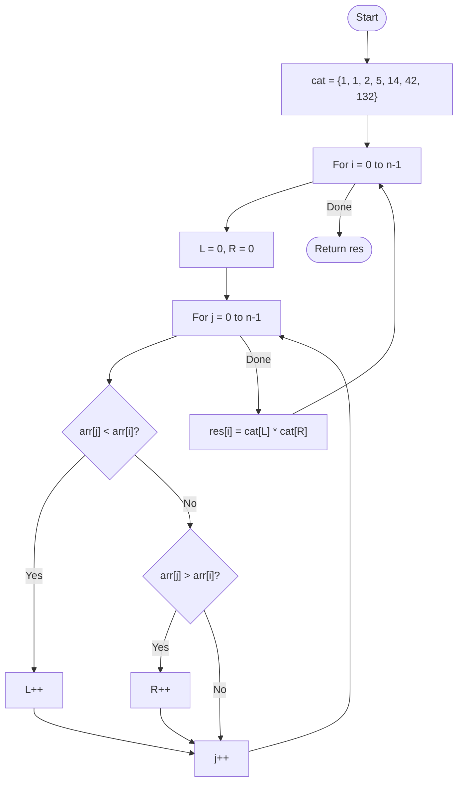

# 💡 Approach — Catalan Numbers & Subtree Combinatorics

| 📄 [Problem](./Problem.md) | 💡 [Approach](./Approach.md) | 🧩 [Solution](./Solution.cpp) | 🚀 [Main](./Main.cpp) |
|:--------------------------:|:-----------------------------:|:------------------------------:|:---------------------:|

---

## 📊 Metadata

---

> [!TIP]
> **Core Insight:** When an element $X$ is chosen as the root of a BST, all elements in the array smaller than $X$ must form the left subtree, and all elements larger than $X$ must form the right subtree. Since any set of $N$ distinct values can form $Catalan(N)$ unique BST shapes, the total count for root $X$ is $Catalan(L) \times Catalan(R)$, where $L$ and $R$ are the counts of smaller and larger elements.

---

## 🔩 Step-by-Step Breakdown
1. **Understand Catalan Numbers ($C_n$):**
   - $C_n$ represents the number of distinct BSTs that can be formed using $n$ distinct nodes.
   - Values: $C_0=1, C_1=1, C_2=2, C_3=5, C_4=14, C_5=42, C_6=132$.
2. **Calculate Counts per Root:**
   - For each element `arr[i]` in the input array:
     - Count elements smaller than `arr[i]` (let this be $L$).
     - Count elements larger than `arr[i]` (let this be $R$).
3. **Apply Formula:**
   - Total BSTs with `arr[i]` as root = $C_L \times C_R$.
4. **Implementation Efficiency:**
   - Since the maximum array size is small ($N \le 6$), we can precompute the first few Catalan numbers and iterate through the array in $O(N^2)$.

---

## 🔄 Mermaid Flowchart

---

## 📊 Complexity Analysis
| Type | Complexity |
| :--- | :--- |
| **Time Complexity** | $O(N^2)$ - Nested loop to count smaller/larger elements. With $N \le 6$, this is negligible. |
| **Space Complexity** | $O(N)$ - To store the result array. |

---

> *"The root defines the divide, but the Catalan sequence defines the possibilities."*

---

<h3>Happy Coding! 🚀</h3>

