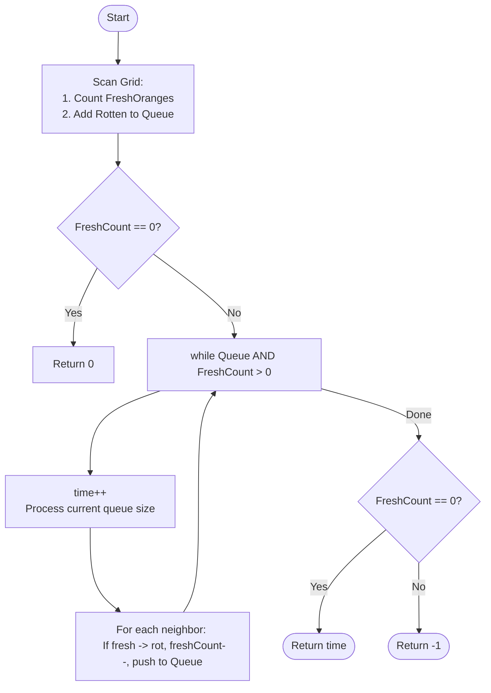

# 💡 Approach — Multi-Source BFS (Grid Spreading)

| 📄 [Problem](./Problem.md) | 💡 [Approach](./Approach.md) | 🧩 [Solution](./Solution.cpp) | 🚀 [Main](./Main.cpp) |
|:--------------------------:|:-----------------------------:|:------------------------------:|:---------------------:|

---

## 📊 Metadata

---

> [!TIP]
> **Core Insight:** This is a classic multi-source BFS problem. By treating all initial rotten oranges as sources and processing the grid level-by-level, we can find the minimum time for the rot to reach every possible cell. Multi-source BFS ensures that each fresh orange is rotted at the earliest possible second.

---

## 🔩 Step-by-Step Breakdown
1. **Initial Scan:**
   - Traverse the entire grid.
   - Count the number of fresh oranges (`freshCount`).
   - Add the coordinates of all rotten oranges (`val = 2`) to a queue.
2. **Handle Base Case:**
   - If `freshCount == 0`, return 0 (no time needed).
3. **Multi-Source BFS:**
   - Use a `while` loop that runs as long as the queue is not empty.
   - At each level (representing 1 minute):
     - Record the current `size` of the queue.
     - For each rotten orange in the current level:
       - Check its 4 neighbors (Up, Down, Left, Right).
       - If a neighbor is fresh (`val = 1`):
         - Set neighbor to rotten (`val = 2`).
         - Decrement `freshCount`.
         - Push neighbor coordinates into the queue for the next level.
     - If any oranges were rotted in this level, increment `time`.
4. **Final Check:**
   - If `freshCount == 0`, return the total `time`.
   - Else, return `-1` (some fresh oranges were unreachable).

---

## 🔄 Mermaid Flowchart

---

## 📊 Complexity Analysis
| Type | Complexity |
| :--- | :--- |
| **Time Complexity** | $O(N \times M)$ - Each cell is visited at most once. |
| **Space Complexity** | $O(N \times M)$ - The queue can store all cells in the worst case. |

---

> *"Rot spreads like a wave; BFS is the only way to track its crest."*

---

<h3>Happy Coding! 🚀</h3>

