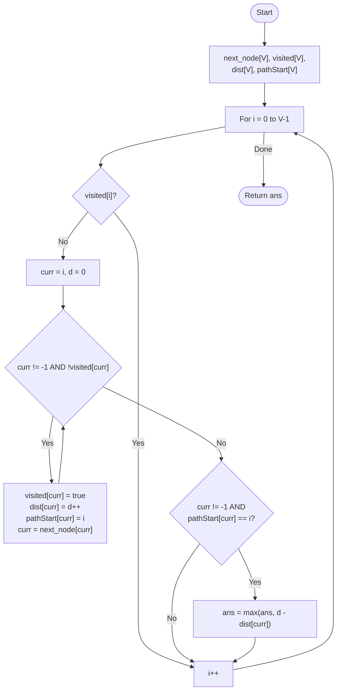

# 💡 Approach — Cycle Detection in Functional Graph

| 📄 [Problem](./Problem.md) | 💡 [Approach](./Approach.md) | 🧩 [Solution](./Solution.cpp) | 🚀 [Main](./Main.cpp) |
|:--------------------------:|:-----------------------------:|:------------------------------:|:---------------------:|

---

## 📊 Metadata

---

> [!TIP]
> **Core Insight:** In a directed graph where each node has at most one outgoing edge (a functional graph), every component contains at most one cycle. We can find the longest cycle in $O(V)$ by simulating traversals and tracking distances from the start of each path. A cycle is detected when we re-visit a node within the same traversal session.

---

## 🔩 Step-by-Step Breakdown
1. **Represent the Graph:**
   - Store the single outgoing edge for each node in a `next_node` array.
2. **Traversal State Management:**
   - `visited[V]`: Boolean array to mark nodes processed across all paths.
   - `dist[V]`: Stores the distance from the start of the current path to the node.
   - `pathStart[V]`: Stores the identifier (start node) of the path that visited this node.
3. **Scan All Vertices:**
   - For each node $i$:
     - If $i$ is unvisited:
       - Start walking from $i$ following the `next_node` pointers.
       - Mark nodes as visited and record their distance and `pathStart = i`.
       - Stop if we hit a node with no outgoing edge or a node that is already `visited`.
4. **Cycle Validation:**
   - If we stopped because we hit a node `curr` where `visited[curr] == true` AND `pathStart[curr] == i`:
     - This means we hit a node from the *current* path $\rightarrow$ a cycle exists.
     - `cycleLength = currentDist - dist[curr]`.
     - Update global `maxCycleLength`.
5. **Return Result:** Return the maximum length found, or -1 if no cycle exists.

---

## 🔄 Mermaid Flowchart

---

## 📊 Complexity Analysis
| Type | Complexity |
| :--- | :--- |
| **Time Complexity** | $O(V)$ - Every node and edge is traversed exactly once. |
| **Space Complexity** | $O(V)$ - Auxiliary arrays to track visitation and distances. |

---

> *"In a functional graph, every path eventually leads to a cycle or a dead end. The trick is knowing when you've seen the same face twice."*

---

<h3>Happy Coding! 🚀</h3>

