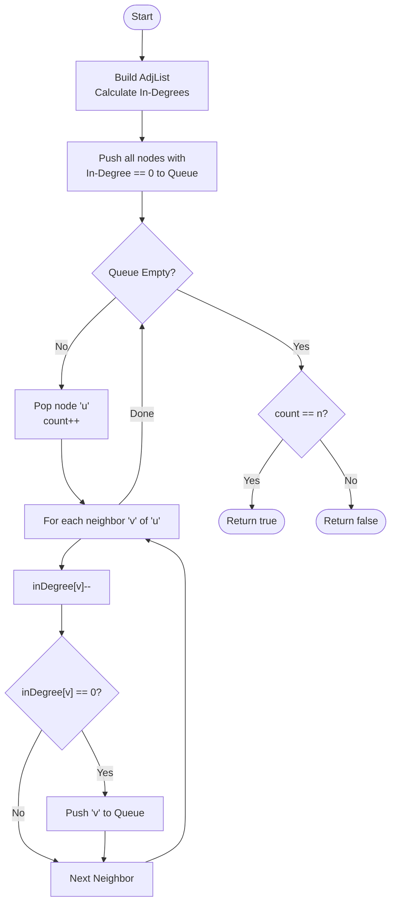

# 💡 Approach — Kahn's Algorithm (Topological Sort)

| 📄 [Problem](./Problem.md) | 💡 [Approach](./Approach.md) | 🧩 [Solution](./Solution.cpp) | 🚀 [Main](./Main.cpp) |
|:--------------------------:|:-----------------------------:|:------------------------------:|:---------------------:|

---

## 📊 Metadata

---

> [!TIP]
> **Core Insight:** The problem of completing courses with prerequisites can be modeled as finding a topological order in a Directed Acyclic Graph (DAG). If the graph contains a cycle, no such order exists. Kahn's Algorithm uses BFS and in-degrees to iteratively remove "source" nodes, naturally detecting cycles if the number of processed nodes is less than the total.

---

## 🔩 Step-by-Step Breakdown
1. **Build the Adjacency List:**
   - Create a graph where an edge $(y \to x)$ exists if $y$ is a prerequisite for $x$.
   - Simultaneously calculate the **in-degree** of each node (number of prerequisites per course).
2. **Initialize BFS Queue:**
   - Push all courses with `in-degree == 0` into a queue. These represent courses with no remaining prerequisites.
3. **Iterative Removal (BFS):**
   - While the queue is not empty:
     - Pop a course `u`.
     - Increment a `completedCount`.
     - For every neighbor `v` of `u`:
       - Decrement `in-degree[v]`.
       - If `in-degree[v]` becomes 0, push `v` to the queue.
4. **Final Verification:**
   - If `completedCount == n`, all courses can be finished.
   - Otherwise, a cycle exists, making it impossible.

---

## 🔄 Mermaid Flowchart

---

## 📊 Complexity Analysis
| Type | Complexity |
| :--- | :--- |
| **Time Complexity** | $O(V + E)$ - Every node and edge is processed once. |
| **Space Complexity** | $O(V + E)$ - Adjacency list storage and in-degree array. |

---

> *"Dependencies are only manageable if they don't loop back to haunt you."*

---

<h3>Happy Coding! 🚀</h3>

