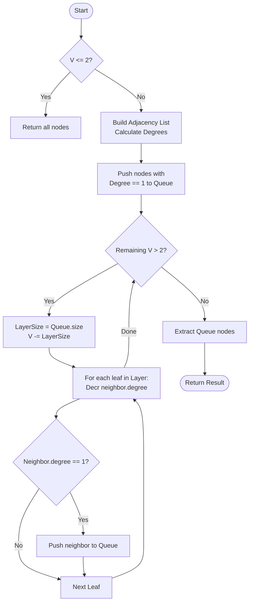

# 💡 Approach — Leaf Removal (Centroid Finding)

| 📄 [Problem](./Problem.md) | 💡 [Approach](./Approach.md) | 🧩 [Solution](./Solution.cpp) | 🚀 [Main](./Main.cpp) |
|:--------------------------:|:-----------------------------:|:------------------------------:|:---------------------:|

---

## 📊 Metadata

---

> [!TIP]
> **Core Insight:** To minimize the height of a tree, the root must be chosen as one of the central nodes. By iteratively removing all current leaf nodes (degree 1) layer-by-level, we eventually narrow down the graph to its core—at most two nodes. This is analogous to finding the "Centroid" of an undirected graph with tree characteristics.

---

## 🔩 Step-by-Step Breakdown
1. **Handle Base Case:**
   - If $V \le 2$, return all available nodes as they are inherently central.
2. **Build Adjacency List & Degrees:**
   - Construct the graph.
   - For each node, store its current degree.
3. **Identify Initial Leaves:**
   - A leaf node is defined as having `degree == 1`.
   - Add all initial leaves to a queue.
4. **Layer-by-Layer Peeling:**
   - While the total remaining vertices $V > 2$:
     - Subtract the current number of leaves from $V$.
     - For each leaf in the current layer:
       - Find its neighbor(s).
       - Decrement the neighbor's degree.
       - If a neighbor's degree becomes 1, it is a leaf for the next layer. Push it to the queue.
5. **Extract Result:** The nodes remaining in the queue after the loop are the roots of the Minimum Height Trees.

---

## 🔄 Mermaid Flowchart

---

## 📊 Complexity Analysis
| Type | Complexity |
| :--- | :--- |
| **Time Complexity** | $O(V)$ - Each node and edge is processed at most once as it becomes a leaf. |
| **Space Complexity** | $O(V)$ - Storing adjacency list and degree array. |

---

> *"The center of a tree is where the balance is found; everything else is just a branch."*

---

<h3>Happy Coding! 🚀</h3>

