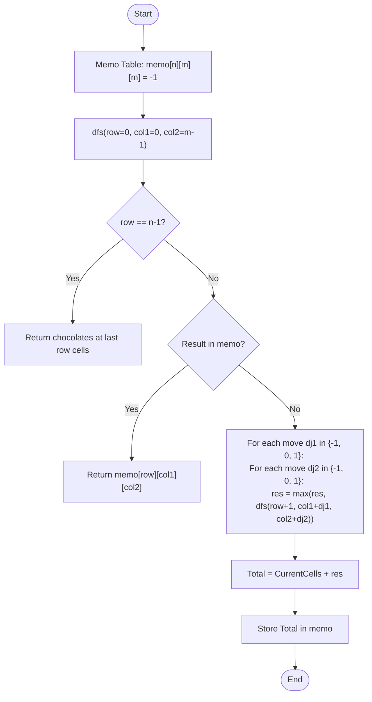

# 💡 Approach — 3D Dynamic Programming (Simultaneous Path Optimization)

| 📄 [Problem](./Problem.md) | 💡 [Approach](./Approach.md) | 🧩 [Solution](./Solution.cpp) | 🚀 [Main](./Main.cpp) |
|:--------------------------:|:-----------------------------:|:------------------------------:|:---------------------:|

---

## 📊 Metadata

---

> [!TIP]
> **Core Insight:** When two robots move down a grid simultaneously, they will always occupy the same row at any given time step. This allows us to reduce a potentially 4D state $(r1, c1, r2, c2)$ into a 3D state $(row, c1, c2)$. By iterating row-by-row and considering all 9 possible combined moves for both robots, we can find the maximum chocolates collected while ensuring overlapping cells are counted only once.

---

## 🔩 Step-by-Step Breakdown
1. **Define the DP State:**
   - `dp[i][j1][j2]` = Maximum chocolates collected when Robot 1 is at `(i, j1)` and Robot 2 is at `(i, j2)`.
2. **Handle Overlap:**
   - If `j1 == j2`, the robot collects `grid[i][j1]`.
   - If `j1 != j2`, they collect `grid[i][j1] + grid[i][j2]`.
3. **Recursive Transitions:**
   - From row `i`, both robots can move to columns $j-1, j, j+1$ in row $i+1$.
   - $dp[i][j1][j2] = \text{CurrentChoc} + \max_{dj1, dj2 \in \{-1, 0, 1\}} (dp[i+1][j1+dj1][j2+dj2])$.
4. **Base Case:**
   - At the last row $i = n-1$: `dp[n-1][j1][j2]` is simply the sum (or single value if $j1=j2$).
5. **Optimization:**
   - We can use memoization (top-down) or iterative (bottom-up) approach.
   - Space can be optimized to $O(M^2)$ since we only need the previous row to compute the current one.

---

## 🔄 Mermaid Flowchart

---

## 📊 Complexity Analysis
| Type | Complexity |
| :--- | :--- |
| **Time Complexity** | $O(N \times M^2 \times 9) \approx O(N \times M^2)$ - We visit each state once. |
| **Space Complexity** | $O(N \times M^2)$ - To store the memoization table. |

---

> *"Two paths, one goal: maximizing sweetness without repeating the same mistake."*

---

<h3>Happy Coding! 🚀</h3>

