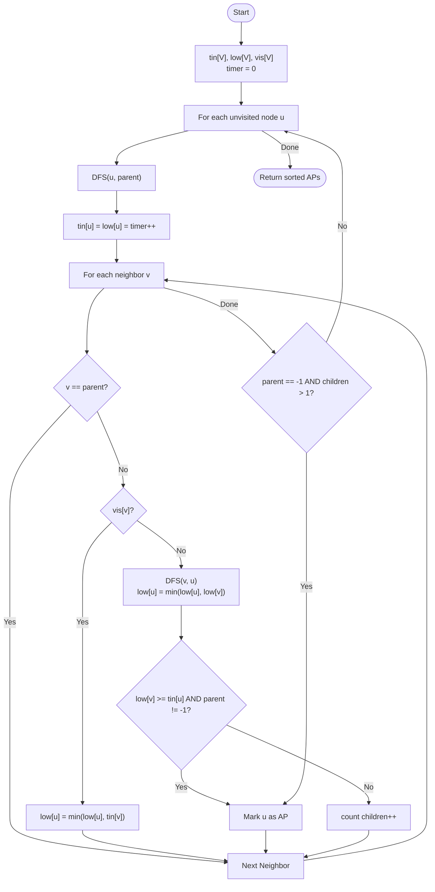

# 💡 Approach — Tarjan's Algorithm (Discovery & Low-Link Values)

| 📄 [Problem](./Problem.md) | 💡 [Approach](./Approach.md) | 🧩 [Solution](./Solution.cpp) | 🚀 [Main](./Main.cpp) |
|:--------------------------:|:-----------------------------:|:------------------------------:|:---------------------:|

---

## 📊 Metadata

---

> [!TIP]
> **Core Insight:** An articulation point is a vertex whose removal increases the number of connected components. Tarjan's algorithm identifies these efficiently in $O(V+E)$ by tracking the discovery time (`tin`) and the lowest reachable discovery time (`low`) for each node. A node $U$ is an articulation point if it has a child $V$ such that no back-edge exists from $V$ or its subtree to any ancestor of $U$ (i.e., `low[V] >= tin[U]`).

---

## 🔩 Step-by-Step Breakdown
1. **Initialize Discovery & Low Values:**
   - `tin[V]`: Stores the time at which each node was discovered.
   - `low[V]`: Stores the lowest `tin` reachable from the node.
2. **DFS Traversal:**
   - For each unvisited node `u`, start a DFS with `timer = 0`.
   - Update `tin[u] = low[u] = timer++`.
3. **Explore Neighbors:**
   - For each neighbor `v` of `u`:
     - If `v` is the parent of `u`, ignore it.
     - **If `v` is unvisited:**
       - Recursively call DFS for `v`.
       - Update `low[u] = min(low[u], low[v])`.
       - **Articulation Point Check:** If `low[v] >= tin[u]` AND `u` is not the root, mark `u` as an AP.
       - Increment `children` count for `u`.
     - **If `v` is visited:**
       - Update `low[u] = min(low[u], tin[v])` (Back-edge found).
4. **Special Case (Root):**
   - If `u` is the root and has more than 1 child in the DFS tree, it is an articulation point.
5. **Format Output:** Collect all marked points, sort them, and handle the empty case by returning `{-1}`.

---

## 🔄 Mermaid Flowchart

---

## 📊 Complexity Analysis
| Type | Complexity |
| :--- | :--- |
| **Time Complexity** | $O(V + E)$ - Standard DFS traversal. |
| **Space Complexity** | $O(V + E)$ - Adjacency list and discovery/low/vis arrays. |

---

> *"A single point of failure can bring down a network; finding it is the first step to resilience."*

---

<h3>Happy Coding! 🚀</h3>

