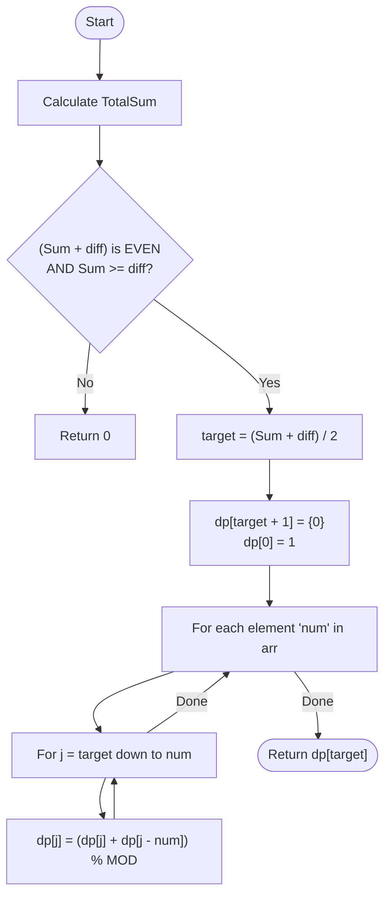

# 💡 Approach — Subset Sum Partitioning (Dynamic Programming)

| 📄 [Problem](./Problem.md) | 💡 [Approach](./Approach.md) | 🧩 [Solution](./Solution.cpp) | 🚀 [Main](./Main.cpp) |
|:--------------------------:|:-----------------------------:|:------------------------------:|:---------------------:|

---

## 📊 Metadata

---

> [!TIP]
> **Core Insight:** The problem of partitioning an array into two subsets with a specific difference $D$ can be mathematically converted into finding the number of subsets with a target sum $T = (TotalSum + D) / 2$. This transformation turns a partition problem into a classic 0/1 Knapsack-style "Subset Sum Count" problem.

---

## 🔩 Step-by-Step Breakdown
1. **Mathematical Reduction:**
   - $S1 + S2 = \text{TotalSum}$
   - $S1 - S2 = \text{diff}$
   - Adding both: $2 \times S1 = \text{TotalSum} + \text{diff} \rightarrow S1 = (\text{TotalSum} + \text{diff}) / 2$.
2. **Handle Edge Cases:**
   - If $(\text{TotalSum} + \text{diff})$ is odd, no integer solution for $S1$ exists. Return 0.
   - If $\text{TotalSum} < \text{diff}$, return 0.
3. **Dynamic Programming (Subset Sum):**
   - Goal: Count subsets that sum to `target = S1`.
   - `dp[j]` = number of ways to form sum `j`.
   - Initialize `dp[0] = 1`.
4. **Iterative Transition:**
   - For each element `x` in `arr`:
     - Update `dp` from `target` down to `x`: `dp[j] = (dp[j] + dp[j-x]) % MOD`.
5. **Final Result:** Return `dp[target]`.

---

## 🔄 Mermaid Flowchart

---

## 📊 Complexity Analysis
| Type | Complexity |
| :--- | :--- |
| **Time Complexity** | $O(N \times \text{target})$ - $N$ elements, each updating a target range. |
| **Space Complexity** | $O(\text{target})$ - Single row DP array optimization. |

---

> *"Breaking a difference into a sum is the first step to solving it with DP."*

---

<h3>Happy Coding! 🚀</h3>

