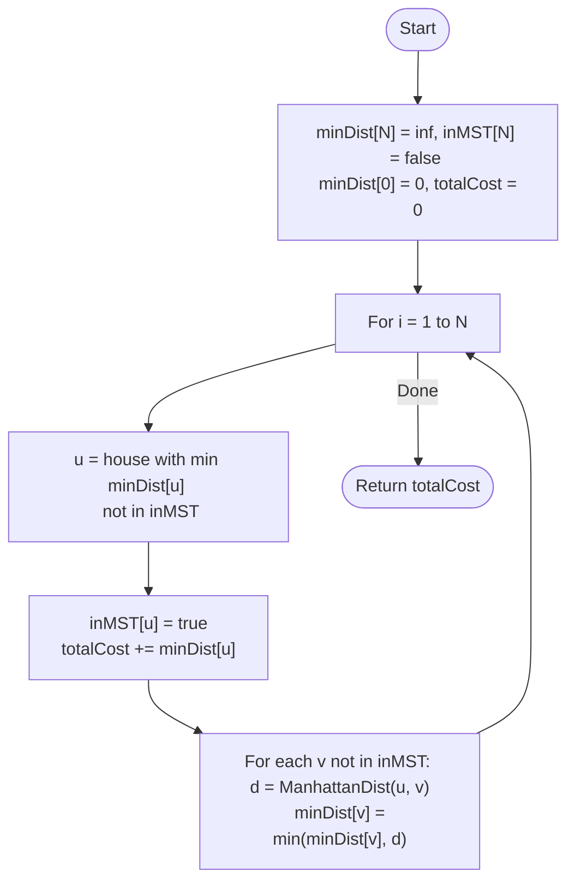

# 💡 Approach — Prim's Algorithm (Minimum Spanning Tree)

| 📄 [Problem](./Problem.md) | 💡 [Approach](./Approach.md) | 🧩 [Solution](./Solution.cpp) | 🚀 [Main](./Main.cpp) |
|:--------------------------:|:-----------------------------:|:------------------------------:|:---------------------:|

---

## 📊 Metadata

---

> [!TIP]
> **Core Insight:** To connect all points in a city with minimum total cost where the cost is Manhattan distance, we are essentially looking for the Minimum Spanning Tree (MST) of a complete graph. For a dense graph with $N$ vertices and $N^2$ edges, Prim's Algorithm using a simple array-based approach is optimal with $O(N^2)$ complexity.

---

## 🔩 Step-by-Step Breakdown
1. **Initialize State Arrays:**
   - `minDist[N]`: Stores the minimum distance from the current MST to each house. Initialize with $\infty$, except `minDist[0] = 0`.
   - `inMST[N]`: Boolean array to track houses already included in the MST.
2. **Main Iteration (N times):**
   - Find the house `u` that is **not** in `inMST` and has the smallest `minDist[u]`.
   - Add `u` to the MST: `inMST[u] = true`.
   - Add `minDist[u]` to the total cost.
3. **Update Distances:**
   - For every house `v` not yet in the MST:
     - Calculate the Manhattan distance between `u` and `v`: $|x_u - x_v| + |y_u - y_v|$.
     - Update `minDist[v] = min(minDist[v], dist(u, v))`.
4. **Final Return:** The accumulated `totalCost`.

---

## 🔄 Mermaid Flowchart

---

## 📊 Complexity Analysis
| Type | Complexity |
| :--- | :--- |
| **Time Complexity** | $O(N^2)$ - We perform $N$ iterations, each finding a minimum in $O(N)$ and updating distances in $O(N)$. |
| **Space Complexity** | $O(N)$ - Storing `minDist` and `inMST` arrays. |

---

> *"A city connected is a city empowered; efficiency lies in the shortest path between all neighbors."*

---

<h3>Happy Coding! 🚀</h3>

