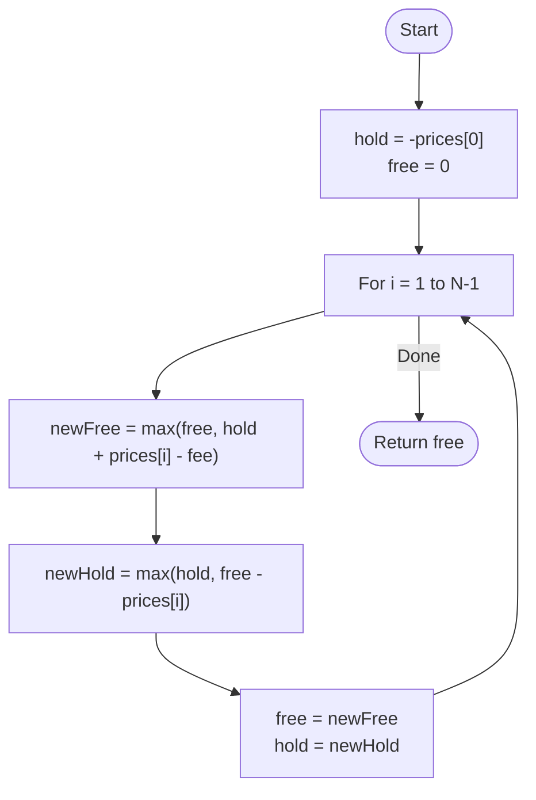

# 💡 Approach — State-Based Dynamic Programming

| 📄 [Problem](./Problem.md) | 💡 [Approach](./Approach.md) | 🧩 [Solution](./Solution.cpp) | 🚀 [Main](./Main.cpp) |
|:--------------------------:|:-----------------------------:|:------------------------------:|:---------------------:|

---

## 📊 Metadata

---

> [!TIP]
> **Core Insight:** To handle the transaction fee efficiently, we track two primary states: `Hold` (currently owning a stock) and `Free` (not owning a stock). By updating these states day-by-day based on the maximum possible profit from buying, selling, or staying put, we can resolve the problem in linear time with constant auxiliary space.

---

## 🔩 Step-by-Step Breakdown
1. **Define States:**
   - `hold`: The maximum profit at the end of the day if we currently **own** a share.
   - `free`: The maximum profit at the end of the day if we **do not own** a share.
2. **Initial Values (Day 0):**
   - `hold = -prices[0]` (We bought the stock on the first day).
   - `free = 0` (We did nothing).
3. **Daily Transitions:**
   - For each day $i$ from 1 to $N-1$:
     - **Update `free`**: We can either stay free from yesterday, or sell the stock we were holding (`hold + prices[i] - fee`).
       - `newFree = max(free, hold + prices[i] - fee)`
     - **Update `hold`**: We can either keep holding from yesterday, or buy a new stock using the profit we had while being free (`free - prices[i]`).
       - `newHold = max(hold, free - prices[i])`
4. **Final Result:** The answer is `free` at the end of the last day, as holding a stock at the end never yields more profit than selling it.

---

## 🔄 Mermaid Flowchart

---

## 📊 Complexity Analysis
| Type | Complexity |
| :--- | :--- |
| **Time Complexity** | $O(N)$ - Single pass through the prices array. |
| **Space Complexity** | $O(1)$ - Only two variables are needed to track state. |

---

> *"The secret to stock trading isn't just knowing when to buy, but knowing if the fee makes the sale worthwhile."*

---

<h3>Happy Coding! 🚀</h3>

