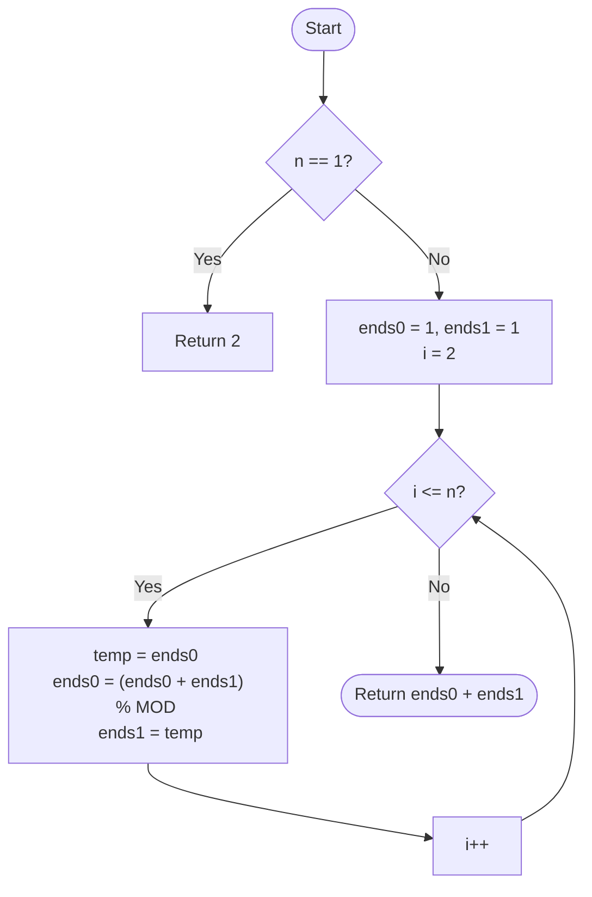

# 💡 Approach — Fibonacci-Based DP (State Transition)

| 📄 [Problem](./Problem.md) | 💡 [Approach](./Approach.md) | 🧩 [Solution](./Solution.cpp) | 🚀 [Main](./Main.cpp) |
|:--------------------------:|:-----------------------------:|:------------------------------:|:---------------------:|

---

## 📊 Metadata

---

> [!TIP]
> **Core Insight:** This problem is a classic application of the Fibonacci sequence. By categorizing valid strings into those ending in '0' and those ending in '1', we observe that a string of length $N$ can be formed by appending '0' to any valid string of length $N-1$, or by appending '1' to a valid string of length $N-1$ that ended in '0'. This leads to the recurrence $W(N) = W(N-1) + W(N-2)$.

---

## 🔩 Step-by-Step Breakdown
1. **Define States:**
   - `ends0`: Number of valid binary strings of length $i$ ending in `0`.
   - `ends1`: Number of valid binary strings of length $i$ ending in `1`.
2. **Initial Case (N=1):**
   - Strings: "0", "1".
   - `ends0 = 1`, `ends1 = 1`.
3. **Transition Logic:**
   - **For length $i$:**
     - To end in `0`: We can append '0' to any valid string of length $i-1$. 
       - `new_ends0 = (ends0 + ends1) % MOD`.
     - To end in `1`: We can only append '1' to strings that ended in '0' yesterday.
       - `new_ends1 = ends0`.
4. **Observation:**
   - Let $T(i) = ends0(i) + ends1(i)$.
   - $T(i) = (ends0(i-1) + ends1(i-1)) + ends0(i-1) = T(i-1) + T(i-2)$.
   - This matches the Fibonacci sequence where $T(1)=2, T(2)=3, T(3)=5$.
5. **Final Result:** Return `(ends0 + ends1) % MOD` for length $N$.

---

## 🔄 Mermaid Flowchart

---

## 📊 Complexity Analysis
| Type | Complexity |
| :--- | :--- |
| **Time Complexity** | $O(N)$ - Linear scan from 2 to $N$. |
| **Space Complexity** | $O(1)$ - Only two variables maintained. |

---

> *"The beauty of binary patterns often mirrors the recursion of nature's sequences."*

---

<h3>Happy Coding! 🚀</h3>

