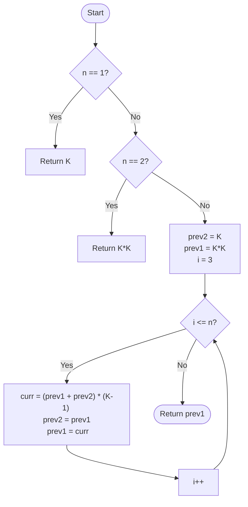

# 💡 Approach — Partition-Based Dynamic Programming

| 📄 [Problem](./Problem.md) | 💡 [Approach](./Approach.md) | 🧩 [Solution](./Solution.cpp) | 🚀 [Main](./Main.cpp) |
|:--------------------------:|:-----------------------------:|:------------------------------:|:---------------------:|

---

## 📊 Metadata

---

> [!TIP]
> **Core Insight:** The problem of painting a fence with $N$ posts such that no more than two consecutive posts share the same color can be broken down into two states at each step: either the current post has the same color as the previous one, or it has a different color. This leads to the recurrence relation $Total(N) = (Total(N-1) + Total(N-2)) \times (K-1)$.

---

## 🔩 Step-by-Step Breakdown
1. **Define Subproblems:**
   - `same[i]`: Ways to paint `i` posts where the last two are the same color.
   - `diff[i]`: Ways to paint `i` posts where the last two are different colors.
2. **Transition Logic:**
   - **For `same[i]`**: The $i$-th post must match the $(i-1)$-th post. This is only possible if the $(i-1)$-th and $(i-2)$-th posts were different.
     - `same[i] = diff[i-1]`
   - **For `diff[i]`**: The $i$-th post must be different from the $(i-1)$-th post. We can choose any of the $K-1$ remaining colors.
     - `diff[i] = (same[i-1] + diff[i-1]) * (K-1)`
3. **Total Ways:**
   - `Total(i) = same[i] + diff[i]`.
   - Substituting `same[i]`: `Total(i) = diff[i-1] + (Total(i-1) * (K-1))`.
   - Since `diff[i-1] = Total(i-2) * (K-1)`, the formula becomes:
     - `Total(i) = (Total(i-1) + Total(i-2)) * (K-1)`.
4. **Base Cases:**
   - `Total(1) = K`
   - `Total(2) = K + K*(K-1) = K^2`
5. **Optimization:** We only need the last two results to compute the next one, allowing $O(1)$ space.

---

## 🔄 Mermaid Flowchart

---

## 📊 Complexity Analysis
| Type | Complexity |
| :--- | :--- |
| **Time Complexity** | $O(N)$ - Linear pass from 3 to $N$. |
| **Space Complexity** | $O(1)$ - Only constant extra variables used. |

---

> *"Creativity in coloring is bounded only by the rules of adjacency."*

---

<h3>Happy Coding! 🚀</h3>

