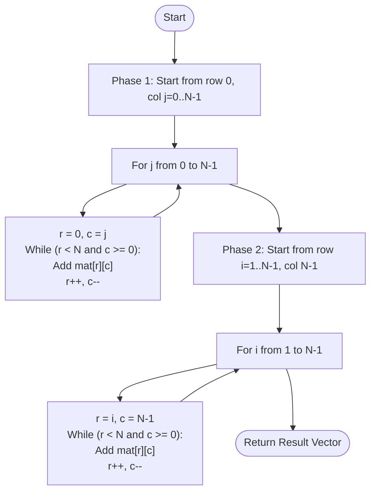

# 💡 Approach — Index-Sum Constant Traversal (Anti-Diagonals)

| 📄 [Problem](./Problem.md) | 💡 [Approach](./Approach.md) | 🧩 [Solution](./Solution.cpp) | 🚀 [Main](./Main.cpp) |
|:--------------------------:|:-----------------------------:|:------------------------------:|:---------------------:|

---

## 📊 Metadata

---

> [!TIP]
> **Core Insight:** In a square matrix, all elements belonging to the same anti-diagonal share a constant index sum $(i + j)$. By iterating through the starting points along the first row $(0, j)$ and the last column $(i, N-1)$, we can systematically extract these diagonals in $O(N^2)$ time by following the vector direction $\vec{d} = (1, -1)$ until we hit a boundary.

---

## 🔩 Step-by-Step Breakdown
1. **Identify Entry Points:**
   - The anti-diagonals start from the first row and the last column.
   - Total number of anti-diagonals is $2N - 1$.
2. **Phase 1: Top Row Starts:**
   - Iterate through each column $J$ in `row 0` (from $J=0$ to $N-1$).
   - For each $J$, set `currRow = 0` and `currCol = J`.
   - Traverse while indices are valid: `currRow++` and `currCol--`.
3. **Phase 2: Last Column Starts:**
   - Iterate through each row $I$ in `column N-1` (from $I=1$ to $N-1$).
   - For each $I$, set `currRow = I` and `currCol = N-1`.
   - Traverse while indices are valid: `currRow++` and `currCol--`.
4. **Result Storage:** Flatten these elements into a single 1D vector.

---

## 🔄 Mermaid Flowchart

---

## 📊 Complexity Analysis
| Type | Complexity |
| :--- | :--- |
| **Time Complexity** | $O(N^2)$ - Every element in the matrix is visited exactly once. |
| **Space Complexity** | $O(N^2)$ - To store the result vector of size $N^2$. |

---

> *"Diagonals are just horizontal lines that chose to take the scenic route across the grid."*

---

<h3>Happy Coding! 🚀</h3>

