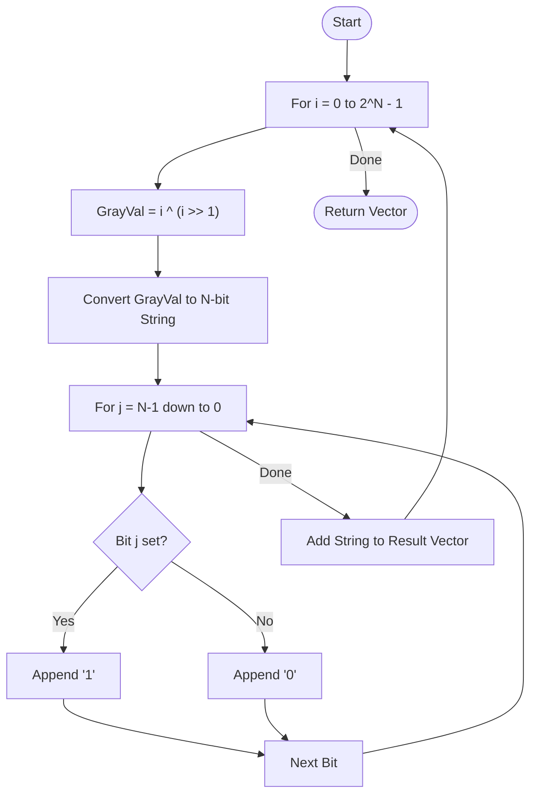

# 💡 Approach — Bitwise Transformation Formula

| 📄 [Problem](./Problem.md) | 💡 [Approach](./Approach.md) | 🧩 [Solution](./Solution.cpp) | 🚀 [Main](./Main.cpp) |
|:--------------------------:|:-----------------------------:|:------------------------------:|:---------------------:|

---

## 📊 Metadata

---

> [!TIP]
> **Core Insight:** A Gray code is a binary numeral system where two successive values differ in only one bit. The most efficient way to generate the $i$-th Gray code directly is using the XOR formula: $G(i) = i \oplus \lfloor i/2 \rfloor$. This allows us to generate the entire sequence in linear time relative to the number of output elements.

---

## 🔩 Step-by-Step Breakdown
1. **Iterative Range:**
   - We need to generate $2^N$ binary strings.
   - Loop $i$ from $0$ to $2^N - 1$.
2. **Apply Gray Code Formula:**
   - For each index $i$, calculate `val = i ^ (i >> 1)`.
   - This formula naturally produces the Gray code sequence.
3. **Binary Formatting:**
   - Convert the integer `val` into a string of length $N$.
   - Iterate from bit $N-1$ down to $0$.
   - Check if the $j$-th bit is set: `(val >> j) & 1`.
   - Append `'1'` or `'0'` accordingly.
4. **Result Storage:** Store each string in a vector and return.

---

## 🔄 Mermaid Flowchart

---

## 📊 Complexity Analysis
| Type | Complexity |
| :--- | :--- |
| **Time Complexity** | $O(N \times 2^N)$ - We iterate $2^N$ times, and each string conversion takes $O(N)$. |
| **Space Complexity** | $O(N \times 2^N)$ - To store $2^N$ strings of length $N$. |

---

> *"Gray code: where a single step in value is a single step in bits."*

---

<h3>Happy Coding! 🚀</h3>

