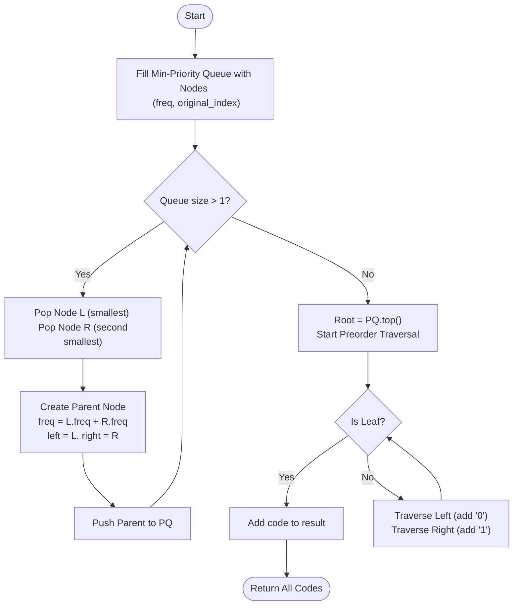

# 💡 Approach — Greedy Priority Queue (Optimal Prefix Coding)

| 📄 [Problem](./Problem.md) | 💡 [Approach](./Approach.md) | 🧩 [Solution](./Solution.cpp) | 🚀 [Main](./Main.cpp) |
|:--------------------------:|:-----------------------------:|:------------------------------:|:---------------------:|

---

## 📊 Metadata

---

> [!TIP]
> **Core Insight:** Huffman encoding uses a greedy strategy to build an optimal binary tree where more frequent characters have shorter bit strings. By maintaining a min-priority queue of nodes and iteratively merging the two smallest, we ensure a minimal weighted external path length. Stability during merging (handling ties) is crucial for matching specific problem requirements, often achieved by tracking insertion indices.

---

## 🔩 Step-by-Step Breakdown
1. **Node Structure:**
   - Define a `Node` containing frequency (`data`), an `index` for tie-breaking, and pointers to `left` and `right` children.
2. **Min-Heap Setup:**
   - Insert all characters as leaf nodes into a Priority Queue.
   - Use a custom comparator that prioritizes lower frequency, then lower index.
3. **Iterative Merging:**
   - While the queue has more than one node:
     - Pop two nodes `L` and `R`.
     - Create a parent node with `data = L->data + R->data`.
     - Assign `L` as the left child and `R` as the right child.
     - Set the parent's `index` to $\min(L->index, R->index)$ to maintain stability.
     - Push the parent back into the queue.
4. **Traversal:**
   - Once the root is formed, perform a **Preorder Traversal**.
   - Append `'0'` when moving left and `'1'` when moving right.
   - Store codes when a leaf node is reached.

---

## 🔄 Mermaid Flowchart

---

## 📊 Complexity Analysis
| Type | Complexity |
| :--- | :--- |
| **Time Complexity** | $O(N \log N)$ - $N$ insertions and deletions from the priority queue. |
| **Space Complexity** | $O(N)$ - To store the Huffman tree and priority queue. |

---

> *"Greed is good when it builds the shortest path to information."*

---

<h3>Happy Coding! 🚀</h3>

