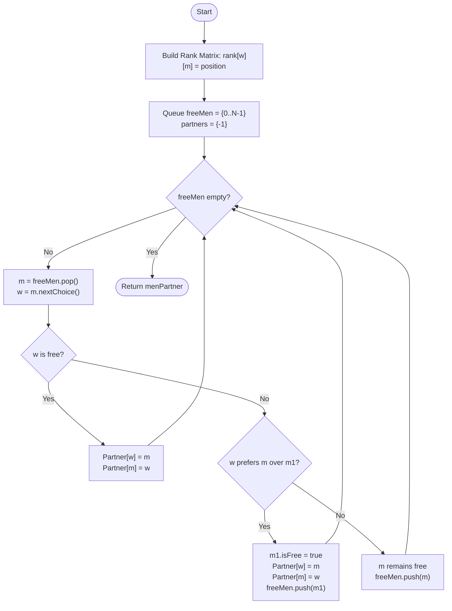

# 💡 Approach — Gale-Shapley Algorithm (Greedy Proposal)

| 📄 [Problem](./Problem.md) | 💡 [Approach](./Approach.md) | 🧩 [Solution](./Solution.cpp) | 🚀 [Main](./Main.cpp) |
|:--------------------------:|:-----------------------------:|:------------------------------:|:---------------------:|

---

## 📊 Metadata

---

> [!TIP]
> **Core Insight:** The Stable Marriage Problem is a fundamental game theory challenge solved by the Gale-Shapley algorithm. It guarantees a stable matching where no two individuals would rather be with each other than their current partners. By pre-calculating preference ranks for efficient $O(1)$ comparisons and maintaining a queue of free agents, we achieve an optimal $O(N^2)$ solution.

---

## 🔩 Step-by-Step Breakdown
1. **Precompute Ranks:**
   - Women's preference lists are given as an ordered list of men.
   - Convert this into a 2D `rank[woman][man]` matrix where `rank[w][m]` is the position of man $M$ in woman $W$'s list. Lower rank is better.
2. **Initialization:**
   - Maintain a queue of `freeMen`.
   - `menPartner` and `womenPartner` arrays to track current engagements, initialized to -1.
   - `nextProposal[man]` array to track which woman a man should propose to next.
3. **The Proposal Loop:**
   - While `freeMen` is not empty:
     - Pop a man $M$.
     - Identify the highest-ranked woman $W$ from $M$'s list that he hasn't proposed to yet.
     - **If $W$ is free:** Engaged $(M, W)$.
     - **If $W$ is engaged to $M'$:**
       - Compare `rank[W][M]` and `rank[W][M']`.
       - If $W$ prefers $M$: Break $(M', W)$, engage $(M, W)$, and add $M'$ back to the `freeMen` queue.
       - If $W$ prefers $M'$: $M$ remains free and will propose to his next choice later.
4. **Result:** Return the `menPartner` array once the queue is empty.

---

## 🔄 Mermaid Flowchart

---

## 📊 Complexity Analysis
| Type | Complexity |
| :--- | :--- |
| **Time Complexity** | $O(N^2)$ - Total number of proposals is at most $N^2$. |
| **Space Complexity** | $O(N^2)$ - To store the preference rank matrix. |

---

> *"Stability isn't about everyone getting their first choice; it's about no one having a reason to defect."*

---

<h3>Happy Coding! 🚀</h3>

