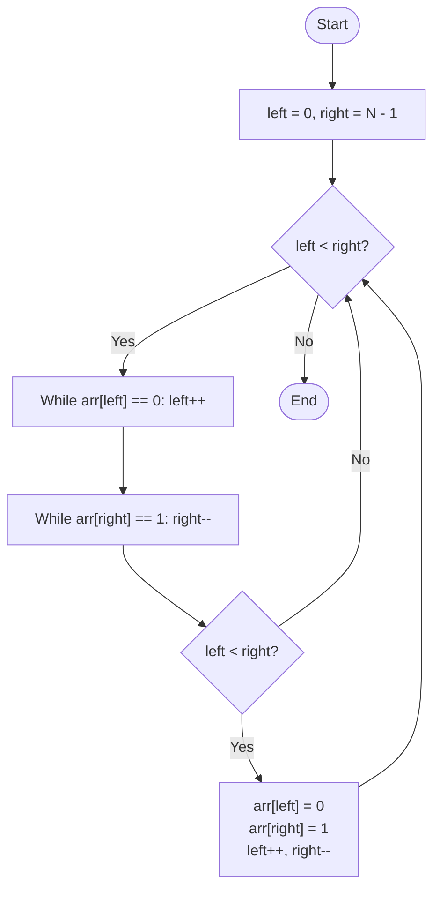

# 💡 Approach — Two-Pointer Optimization (Single Pass)

| 📄 [Problem](./Problem.md) | 💡 [Approach](./Approach.md) | 🧩 [Solution](./Solution.cpp) | 🚀 [Main](./Main.cpp) |
|:--------------------------:|:-----------------------------:|:------------------------------:|:---------------------:|

---

## 📊 Metadata

---

> [!TIP]
> **Core Insight:** To segregate binary elements in a single pass, the two-pointer technique is the most efficient. By maintaining a `left` pointer for zeros and a `right` pointer for ones, we can greedily narrow down the middle while swapping misplaced elements. This ensures $O(N)$ time with minimal $O(1)$ auxiliary space.

---

## 🔩 Step-by-Step Breakdown
1. **Initialize Pointers:**
   - `left = 0` (pointing to the start of the array).
   - `right = N - 1` (pointing to the end of the array).
2. **Narrow the Search:**
   - While `left < right`:
     - Move `left` forward as long as `arr[left]` is already $0$.
     - Move `right` backward as long as `arr[right]` is already $1$.
3. **Swap Misplaced Elements:**
   - If `left < right` after movement, it means `arr[left]` is $1$ and `arr[right]` is $0$.
   - Swap them: `arr[left] = 0`, `arr[right] = 1`.
   - Increment `left` and decrement `right`.
4. **Termination:** The loop continues until the pointers meet, at which point all $0$s are on the left and $1$s are on the right.

---

## 🔄 Mermaid Flowchart

---

## 📊 Complexity Analysis
| Type | Complexity |
| :--- | :--- |
| **Time Complexity** | $O(N)$ - Each element is visited at most once by either pointer. |
| **Space Complexity** | $O(1)$ - In-place transformation using only two variables. |

---

> *"Sorting is just the art of putting things where they belong, one swap at a time."*

---

<h3>Happy Coding! 🚀</h3>

