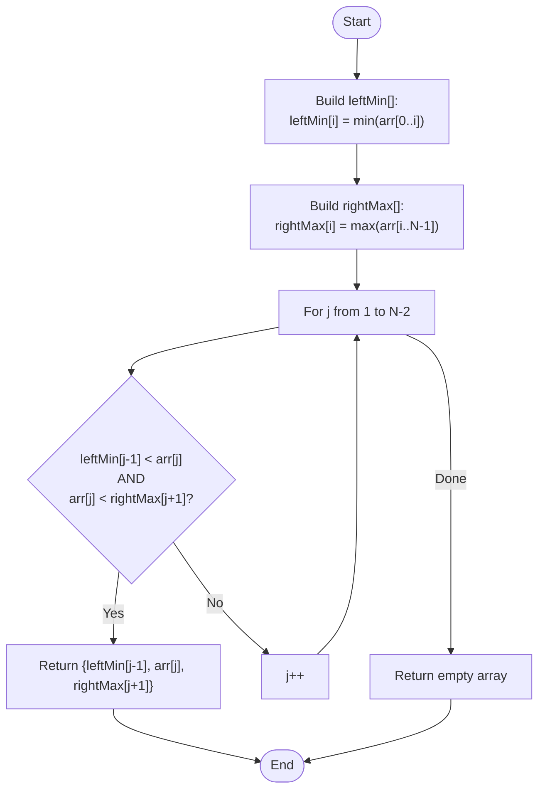

# 💡 Approach — Prefix-Min and Suffix-Max (Three-Pointer Strategy)

| 📄 [Problem](./Problem.md) | 💡 [Approach](./Approach.md) | 🧩 [Solution](./Solution.cpp) | 🚀 [Main](./Main.cpp) |
|:--------------------------:|:-----------------------------:|:------------------------------:|:---------------------:|

---

## 📊 Metadata

---

> [!TIP]
> **Core Insight:** To find a sorted subsequence of size 3 in $O(N)$ time, we need to identify a "middle" element $arr[j]$ that has at least one smaller element to its left and at least one larger element to its right. Pre-calculating prefix minimums and suffix maximums allows us to check these conditions for each index in constant time.

---

## 🔩 Step-by-Step Breakdown
1. **Precompute Prefix Minimums:**
   - Create an array `leftMin` where `leftMin[i]` stores the smallest element found in `arr[0...i]`.
   - This identifies the best candidate for the first element $arr[i]$ in our $i < j < k$ chain.
2. **Precompute Suffix Maximums:**
   - Create an array `rightMax` where `rightMax[i]` stores the largest element found in `arr[i...N-1]`.
   - This identifies the best candidate for the third element $arr[k]$ in our $i < j < k$ chain.
3. **Find the Pivot:**
   - Iterate through the array from $j = 1$ to $N-2$.
   - For each $j$, check if `leftMin[j-1] < arr[j]` AND `arr[j] < rightMax[j+1]`.
4. **Result:** If the condition is met, return `{leftMin[j-1], arr[j], rightMax[j+1]}`. Otherwise, return an empty array.

---

## 🔄 Mermaid Flowchart

---

## 📊 Complexity Analysis
| Type | Complexity |
| :--- | :--- |
| **Time Complexity** | $O(N)$ - Three linear passes over the array. |
| **Space Complexity** | $O(N)$ - Auxiliary storage for `leftMin` and `rightMax`. |

---

> *"The middle element is the bridge that connects the small past to the large future."*

---

<h3>Happy Coding! 🚀</h3>

