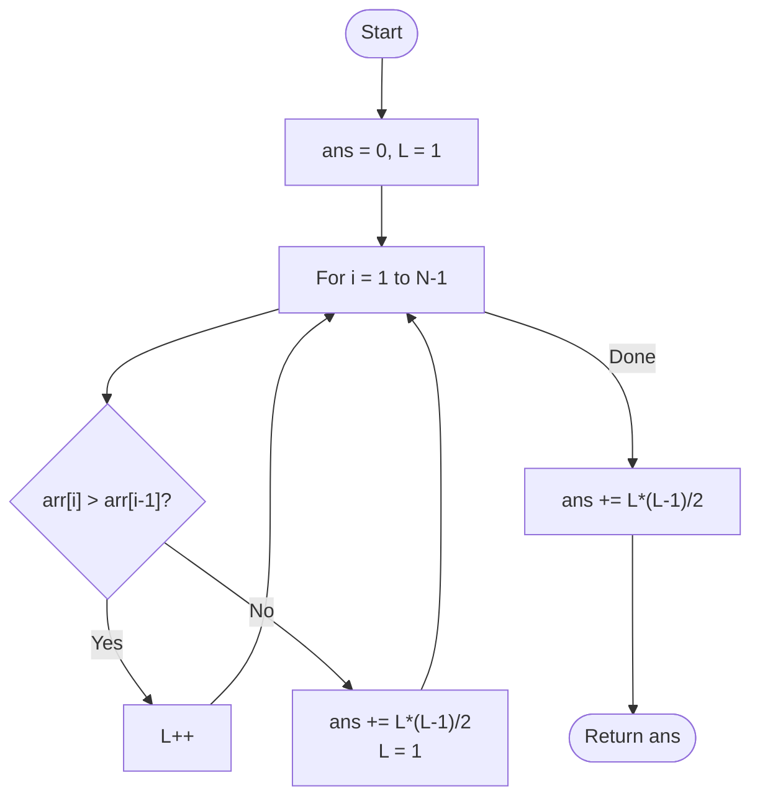

# 💡 Approach — Arithmetic Progression of Segment Subarrays

| 📄 [Problem](./Problem.md) | 💡 [Approach](./Approach.md) | 🧩 [Solution](./Solution.cpp) | 🚀 [Main](./Main.cpp) |
|:--------------------------:|:-----------------------------:|:------------------------------:|:---------------------:|

---

## 📊 Metadata

---

> [!TIP]
> **Core Insight:** A strictly increasing segment of length $L$ contributes exactly $\frac{L(L-1)}{2}$ subarrays of length $\ge 2$. By identifying maximal contiguous increasing segments in a single $O(N)$ pass, we can compute the total count using simple combinatorial math without explicitly enumerating the subarrays.

---

## 🔩 Step-by-Step Breakdown
1. **Identify Segments:**
   - Traverse the array and track the length of the current strictly increasing segment (`currentLen`).
2. **Transition Condition:**
   - If `arr[i] > arr[i-1]`, increment `currentLen`.
   - If `arr[i] <= arr[i-1]`, the segment has ended.
3. **Calculate Contributions:**
   - For a segment of length $L$, the number of valid subarrays (size $\ge 2$) is the sum of choices:
     - Subarrays of size 2: $L-1$
     - Subarrays of size 3: $L-2$
     - ...
     - Subarrays of size L: $1$
   - Total = $\sum_{k=1}^{L-1} k = \frac{L(L-1)}{2}$.
4. **Iterative Update:**
   - Whenever a segment ends, add $\frac{L(L-1)}{2}$ to the total and reset `currentLen` to 1.
5. **Handle Final Segment:**
   - Ensure the last segment's contribution is added after the loop finishes.

---

## 🔄 Mermaid Flowchart

---

## 📊 Complexity Analysis
| Type | Complexity |
| :--- | :--- |
| **Time Complexity** | $O(N)$ - Single linear scan of the array. |
| **Space Complexity** | $O(1)$ - No extra space used besides counters. |

---

> *"Sequences are just data points until you find the rhythm of their growth."*

---

<h3>Happy Coding! 🚀</h3>

