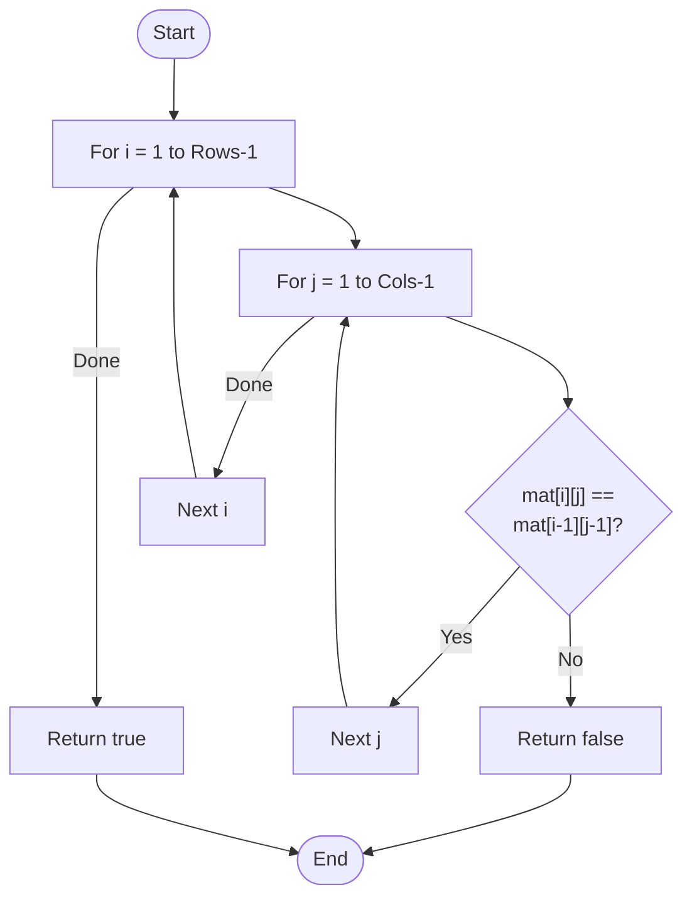

# 💡 Approach — Diagonal Invariance Check

| 📄 [Problem](./Problem.md) | 💡 [Approach](./Approach.md) | 🧩 [Solution](./Solution.cpp) | 🚀 [Main](./Main.cpp) |
|:--------------------------:|:-----------------------------:|:------------------------------:|:---------------------:|

---

## 📊 Metadata

---

> [!TIP]
> **Core Insight:** A Toeplitz matrix is characterized by the property that all elements on any given top-left to bottom-right diagonal are identical. Mathematically, this means $mat[i][j]$ must equal $mat[i-1][j-1]$ for all indices where both are valid. A single $O(N \times M)$ pass comparing each element to its upper-left neighbor is sufficient to validate this property.

---

## 🔩 Step-by-Step Breakdown
1. **Define the Property:**
   - For every element $mat[i][j]$ (where $i > 0$ and $j > 0$), it must match its top-left neighbor $mat[i-1][j-1]$.
2. **Iterative Verification:**
   - Start a nested loop from the second row ($i=1$) and second column ($j=1$).
   - For each cell $(i, j)$:
     - Compare $mat[i][j]$ with $mat[i-1][j-1]$.
     - If they are **not equal**, the matrix is not Toeplitz. Return `false` immediately.
3. **Success Condition:**
   - If the loops complete without any mismatch, return `true`.

---

## 🔄 Mermaid Flowchart

---

## 📊 Complexity Analysis
| Type | Complexity |
| :--- | :--- |
| **Time Complexity** | $O(N \times M)$ - Every cell in the matrix is visited once. |
| **Space Complexity** | $O(1)$ - Constant space usage. |

---

> *"The beauty of a Toeplitz matrix lies in the predictability of its descent."*

---

<h3>Happy Coding! 🚀</h3>

