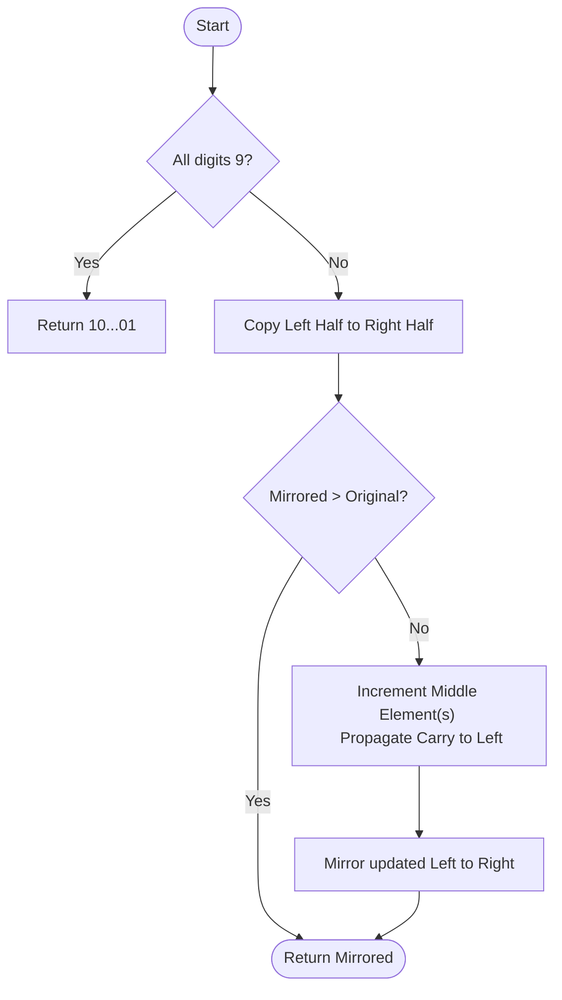

# 💡 Approach — Center-Outward Mirroring and Carry Propagation

| 📄 [Problem](./Problem.md) | 💡 [Approach](./Approach.md) | 🧩 [Solution](./Solution.cpp) | 🚀 [Main](./Main.cpp) |
|:--------------------------:|:-----------------------------:|:------------------------------:|:---------------------:|

---

## 📊 Metadata

---

> [!TIP]
> **Core Insight:** Finding the next smallest palindrome requires a greedy approach centered around mirroring the left half of the number. If the resulting palindrome is not strictly larger than the original, we must increment the middle elements and propagate the carry outwards. Handling the "all-nines" case as a length-expansion exception is key to maintaining linear time complexity.

---

## 🔩 Step-by-Step Breakdown
1. **The "All 9s" Exception:**
   - If the input is $99...9$, the next palindrome is $100...01$ (one digit longer).
   - Example: $999 \rightarrow 1001$.
2. **Standard Case — Mirroring:**
   - Copy the left half of the array onto the right half.
   - Example: $[2, 3, 5, 4, 5] \rightarrow [2, 3, 5, 3, 2]$.
3. **Validation & Improvement:**
   - Compare the mirrored version with the original.
   - **Case A: Mirrored > Original:** We are done. Return the mirrored array.
   - **Case B: Mirrored <= Original:**
     - We need a larger number. Increment the middle-most digit(s).
     - If the middle digit is $9$, set it to $0$ and propagate the carry to the left.
     - Mirror the updated left half to the right half again.
4. **Implementation Detail:** To avoid full-array comparisons, scan from the middle outwards to find the first differing digit. If the left digit is smaller than the right (or all are equal), the "Mirrored <= Original" logic applies.

---

## 🔄 Mermaid Flowchart

---

## 📊 Complexity Analysis
| Type | Complexity |
| :--- | :--- |
| **Time Complexity** | $O(N)$ - Single pass for nines check, single pass for mirroring, and single pass for carry propagation. |
| **Space Complexity** | $O(N)$ - To store the result array. |

---

> *"Palindromes are the echoes of numbers; finding the next one is about knowing where to shout."*

---

<h3>Happy Coding! 🚀</h3>

