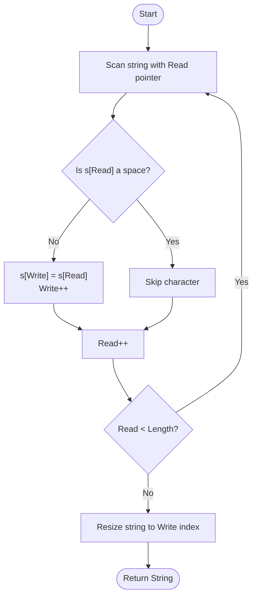

# 💡 Approach — In-Place String Compaction (Erase-Remove Idiom)

| 📄 [Problem](./Problem.md) | 💡 [Approach](./Approach.md) | 🧩 [Solution](./Solution.cpp) | 🚀 [Main](./Main.cpp) |
|:--------------------------:|:-----------------------------:|:------------------------------:|:---------------------:|

---

## 📊 Metadata

---

> [!TIP]
> **Core Insight:** Removing characters from a string in-place is most efficiently done using the Erase-Remove idiom. `std::remove` shifts the valid characters to the front of the container in $O(N)$ time, and `s.erase` trims the leftover capacity. This avoids creating an auxiliary string and minimizes allocations.

---

## 🔩 Step-by-Step Breakdown
1. **The Erase-Remove Idiom:**
   - C++ strings (and vectors) don't automatically resize when elements are "removed". Instead, `std::remove` logically moves the targeted elements to the end and returns an iterator to the new boundary.
2. **Phase 1: Shift (`std::remove`)**
   - Traverse the string from left to right.
   - For every non-space character, move it to the earliest available position at the front.
   - This returns an iterator `it` pointing to the first "stale" character after the compacted prefix.
3. **Phase 2: Trim (`s.erase`)**
   - Use the `erase` method to delete everything from `it` to `s.end()`.
   - This physically shrinks the string to the correct length.
4. **Alternative — Two Pointer Manual:**
   - Keep a `write` index.
   - Loop with a `read` index. If `s[read] != ' '`, set `s[write++] = s[read]`.
   - Finally, `s.resize(write)`.

---

## 🔄 Mermaid Flowchart

---

## 📊 Complexity Analysis
| Type | Complexity |
| :--- | :--- |
| **Time Complexity** | $O(N)$ - Single pass through the string. |
| **Space Complexity** | $O(1)$ - In-place modification. |

---

> *"Efficiency is the silent space between characters that shouldn't be there."*

---

<h3>Happy Coding! 🚀</h3>

