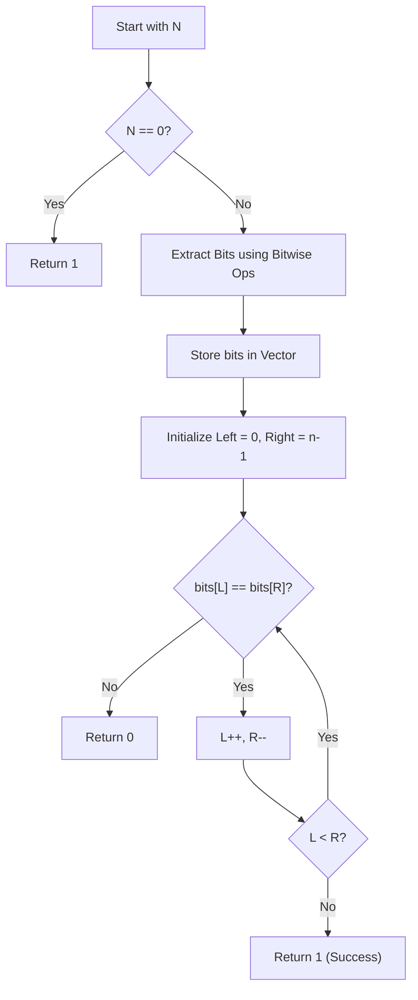

# Palindrome Binary Representation — Approach & Explanation

---

## 🔗 Related Files

| File | Description |
|:-----|:------------|
| [Problem.md](Problem.md) | Full problem statement & constraints |
| [Solution.cpp](Solution.cpp) | Implementation using bit extraction |
| [Main.cpp](Main.cpp) | Test driver for verification |

---

## 💡 Core Intuition

The problem asks to check if the binary form of a number is a palindrome. For example, $17$ in binary is `10001`. Since `10001` read backwards is still `10001`, it's a palindrome.

The most straightforward way is to:
1.  **Extract bits** from the number one by one.
2.  **Store** them in a structure (like a vector or string).
3.  **Verify** if that structure is palindromic using two-pointer technique.

---

## 🪜 Algorithm

1.  **Bit Extraction:**
    - Use `N & 1` to get the least significant bit.
    - Store the bit in a list.
    - Right shift `N` by 1 (`N >>= 1`) to move to the next bit.
    - Repeat until `N` becomes 0.
2.  **Two-Pointer Check:**
    - Initialize `left = 0` and `right = size - 1`.
    - Compare `bits[left]` and `bits[right]`.
    - If they differ, return `0`.
    - Increment `left`, decrement `right`.
    - If loop completes, return `1`.

---

## 📊 Visualization — Binary Conversion

Example: **N = 17**

| Step | N (Dec) | N (Bin) | Bit Extracted | List (Bits) |
|:----:|:-------:|:-------:|:-------------:|:-----------:|
| 1    | 17      | `10001` | 1             | `[1]`       |
| 2    | 8       | `1000`  | 0             | `[1, 0]`    |
| 3    | 4       | `100`   | 0             | `[1, 0, 0]` |
| 4    | 2       | `10`    | 0             | `[1, 0, 0, 0]` |
| 5    | 1       | `1`     | 1             | `[1, 0, 0, 0, 1]` |

**Result:** `[1, 0, 0, 0, 1]` is a palindrome! ✅

---

## 🔄 Mermaid Flowchart

---

## ⚙️ Complexity Analysis

| Metric | Value | Reason |
|:-------|:------|:-------|
| **Time** | $O(\log_2 N)$ | We process each bit of the number. For $10^{18}$, this is at most 60 iterations. |
| **Space** | $O(\log_2 N)$ | We store the bits in a vector. |

---

## 🧩 Optimization Note
One could also reverse the bits as an integer and compare it with the original $N$ to achieve $O(1)$ auxiliary space. However, the vector approach is intuitive and well within the space constraints.
